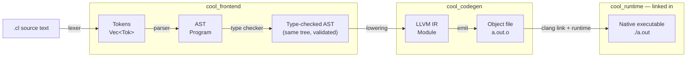
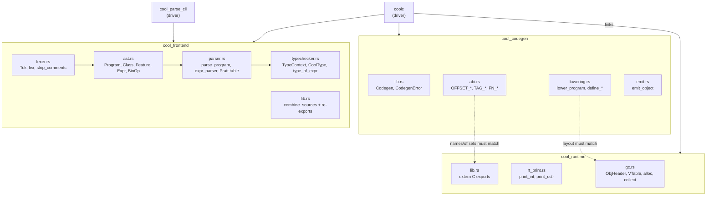
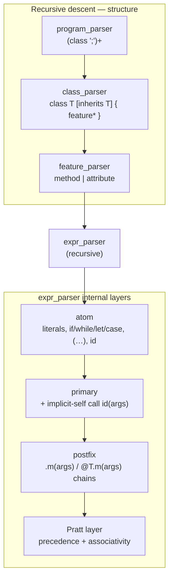
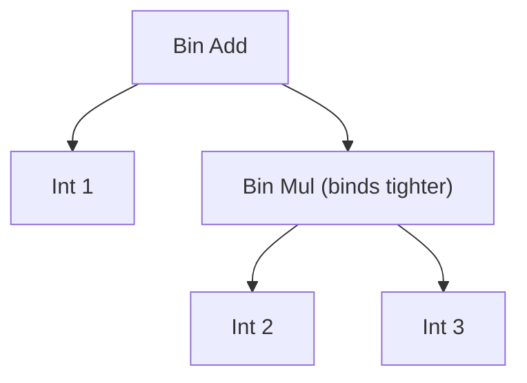
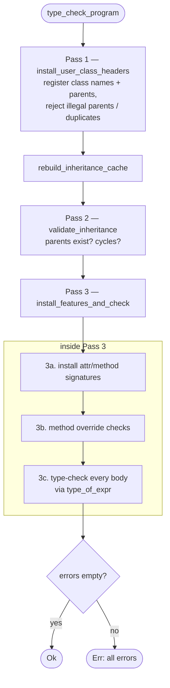
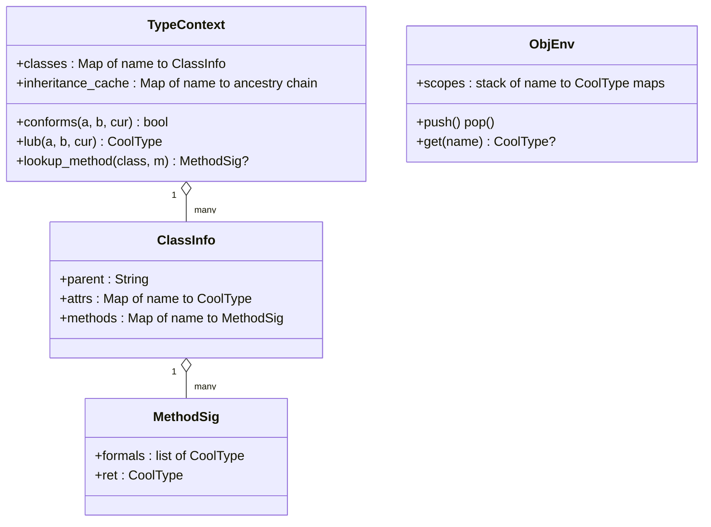
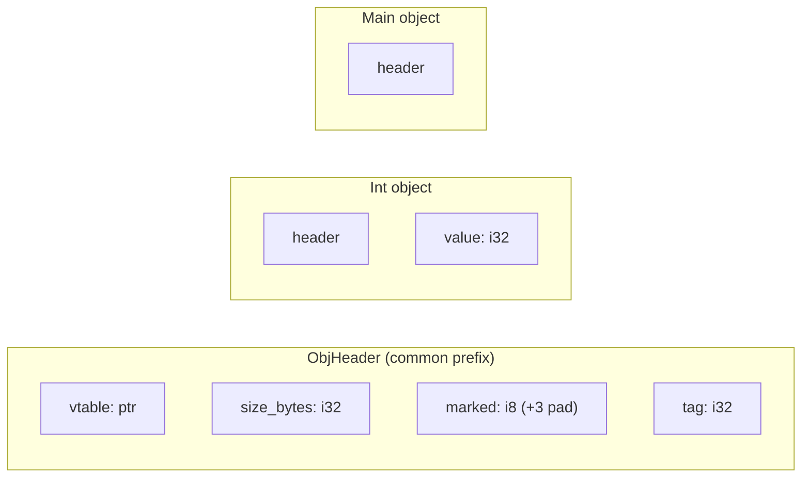
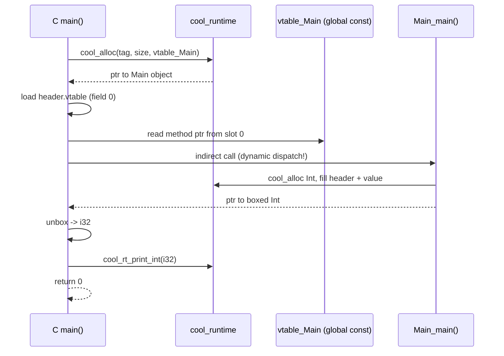
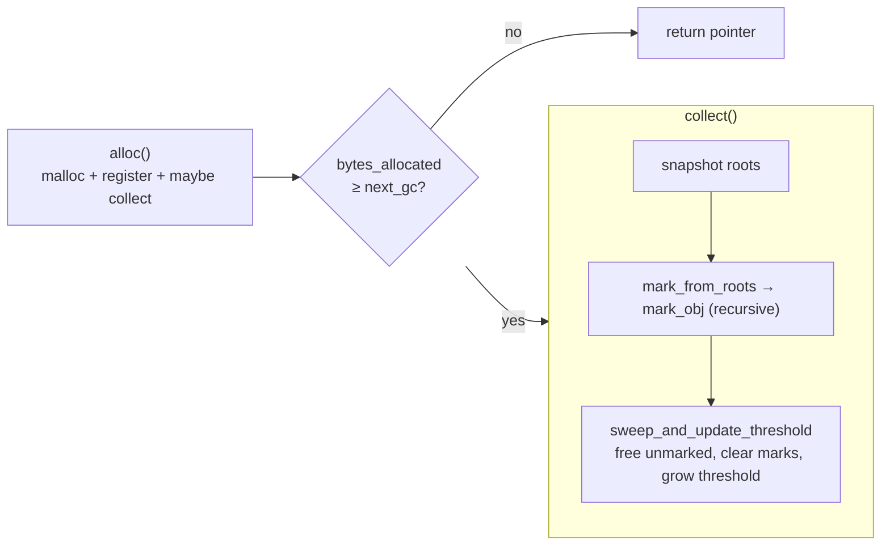
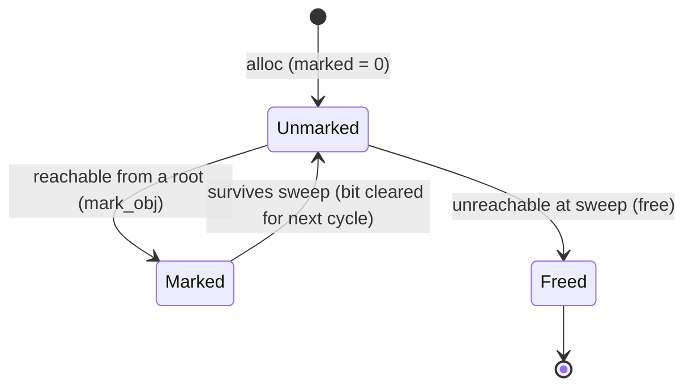

# Architecture

A guided tour of how this COOL compiler is built. The goal of this document is
to connect three vocabularies that usually live in separate books —

- **COOL language concepts** (classes, `SELF_TYPE`, dispatch, conformance),
- **classic compiler-construction concepts** (lexing, parsing, type judgements,
  lowering, code generation), and
- **systems / LLVM / runtime concepts** (IR, vtables, object layout, GC) —

— to the **actual modules, structs, and functions** in this repository, so you
can read the code with a map in hand.

> If you just want to build and run, see the [README](README.md). This document
> is about *why the code is shaped the way it is*.

---

## 1. The big picture

A compiler is a pipeline of *representations*. Each stage takes one
representation of the program and produces a more refined one, until the program
is something the machine can run.

Two driver binaries orchestrate this pipeline:

| Binary | What it runs | Entry point |
| --- | --- | --- |
| `cool_parse_cli` | lex → parse → type-check, then dump the AST | `crates/cool_parse_cli/src/main.rs` |
| `coolc` | the whole pipeline, ending in a linked `./a.out` | `crates/coolc/src/main.rs` → `run()` |

Both read input via the shared `cool_frontend::combine_sources` helper, which
concatenates multiple `.cl` files into one logical program.

---

## 2. Crate / module map

The workspace is split so that the language-understanding half (no LLVM
dependency) is cleanly separated from the machine-code half.

The dotted edges are the most important thing to internalize: `cool_codegen` and
`cool_runtime` are compiled **separately** and only meet at link time, so they
must agree byte-for-byte on object layout and symbol names. `abi.rs` is the
written contract; see [§7](#7-the-abi-the-contract-between-codegen-and-runtime).

---

## 3. Stage 1 — Lexer (`lexer.rs`)

**Concept.** Lexing (a.k.a. scanning / tokenizing) turns a flat stream of
characters into a flat stream of *tokens* — the smallest meaningful units
(keywords, identifiers, literals, punctuation). It discards whitespace and
comments.

**Code.**

| Concept | In the code |
| --- | --- |
| Token kinds | `enum Tok` (a [`logos`](https://github.com/maciejhirsz/logos) derive) |
| The DFA that recognizes tokens | the `#[token]` / `#[regex]` attributes on `Tok` |
| Decoding a string literal's escapes | `fn parse_string` |
| Stripping (nested) comments | `fn strip_comments` |
| The public entry point | `fn lex(&str) -> Result<Vec<Tok>, String>` |

**Why two passes?** COOL allows *nested* block comments `(* ... (* ... *) ... *)`.
A regular expression (and therefore Logos) cannot count nesting depth, so
`strip_comments` is a tiny hand-written pre-pass that removes comments *before*
Logos runs. It scans raw bytes (every comment marker is ASCII, and ASCII bytes
never appear inside a UTF-8 multi-byte sequence) and copies all other bytes
verbatim, so non-ASCII characters inside string literals survive intact.

**COOL detail captured here:** keywords are case-insensitive (`#[regex(r"(?i:class)")]`),
*except* `true`/`false`, which must start with a lowercase letter — hence the
special regexes for `KwTrue`/`KwFalse`, and the distinction between `TypeId`
(uppercase-initial) and `ObjId` (lowercase-initial).

---

## 4. Stage 2 — Parser & AST (`parser.rs`, `ast.rs`)

**Concept.** Parsing imposes *structure* on the token stream, producing an
**Abstract Syntax Tree (AST)** — a tree whose shape encodes grouping,
precedence, and nesting. The AST (`ast.rs`) is the contract between the parser
and everything downstream.

This compiler uses a **hybrid** strategy:

- **Recursive descent** for non-expression structure (`program_parser`,
  `class_parser`, `feature_parser`, `formal_parser`). Each grammar rule is one
  combinator function, built with the [`chumsky`](https://github.com/zesterer/chumsky)
  library.
- **Pratt parsing** (top-down operator precedence) for the operator soup inside
  `expr_parser`. Pratt parsing resolves precedence with numeric *binding powers*
  instead of the many layered grammar rules a pure recursive-descent parser would
  need.

### Precedence — where the tree shape comes from

The Pratt table in `expr_parser` assigns each operator a binding power; **higher
binds tighter**. These follow COOL's precedence table (tightest first):

| Operator(s) | Binding power constant | Associativity |
| --- | --- | --- |
| `.` `@` (dispatch) | handled by the `postfix` layer | left |
| `~` (neg) | `BP_NEG = 9` | prefix |
| `isvoid` | `BP_ISVOID = 8` | prefix |
| `*` `/` | `BP_MUL = 7` | left |
| `+` `-` | `BP_ADD = 6` | left |
| `<=` `<` `=` | `BP_CMP = 5` | left |
| `not` | `BP_NOT = 4` | prefix |
| `<-` (assign) | `BP_ASSIGN = 3` | right |

This is exactly what makes `1 + 2 * 3` parse as `1 + (2 * 3)`:

> 🐛 *Historical note:* this table was once inverted (addition bound tighter than
> multiplication), so `1 + 2 * 3` evaluated to `9`. The regression test
> `parser::tests::arithmetic_precedence_mul_binds_tighter_than_add` now guards it.

### The AST node types (`ast.rs`)

| COOL construct | AST node |
| --- | --- |
| whole program | `struct Program { classes }` |
| a class | `struct Class { name, parent, features }` |
| method / attribute | `enum Feature::{Method, Attr}` |
| a parameter | `struct Formal` |
| every expression form | `enum Expr` (`If`, `While`, `Let`, `Case`, `Dispatch`, `Bin`, `New`, …) |
| binary operators | `enum BinOp` |

Two design choices worth noting:

- **Types are just `String`s in the AST.** At parse time we don't yet know which
  class names are valid, so `Class::parent`, `Formal::ty`, etc. hold raw text.
  The type checker resolves them later.
- **Recursion goes through `Box`** (e.g. `If { cond: Box<Expr>, … }`) because a
  Rust enum can't contain itself by value.
- **All three dispatch forms collapse into one node** (`Expr::Dispatch`): dynamic
  `r.m(a)`, static `r@T.m(a)`, and implicit-self `m(a)` (the parser rewrites the
  last into a dispatch on `Expr::Self_`).

---

## 5. Stage 3 — Type checker (`typechecker.rs`)

**Concept.** The type checker enforces the language's *static semantics*: the
rules about what programs are meaningful, beyond mere grammar. It implements the
formal typing rules from **§12 of the COOL manual**. Where the parser cares about
*shape*, the checker is the first stage that understands *meaning*.

### The data structures

| Concept | In the code |
| --- | --- |
| A COOL type (a class name, or `SELF_TYPE`) | `enum CoolType` |
| The *class table* (all classes → parent/attrs/methods) | `TypeContext.classes : HashMap<String, ClassInfo>` |
| A method's signature | `struct MethodSig { formals, ret }` |
| The variable environment `O` (name → type) | `struct ObjEnv` (a stack of scopes) |
| A reported error | `struct TypeError` |
| Cached ancestry chains | `TypeContext.inheritance_cache` |

### The three passes

COOL allows forward references (a class may use one defined later), so checking
runs in passes over the program:

> **Error recovery:** the checker threads a `&mut Vec<TypeError>` through the whole
> walk and *keeps going* after an error (substituting a best-guess type, often
> `Object`). This is why a single run can report many errors at once.

### The key judgements (and the functions that implement them)

| COOL / type-theory concept | Plain meaning | Function |
| --- | --- | --- |
| **Conformance** `A ≤ B` | an `A` is usable where a `B` is expected (same class or a descendant) | `TypeContext::conforms` |
| **Least Upper Bound** (join) | most specific common ancestor; types an `if`/`case` whose branches differ | `TypeContext::lub` |
| **`SELF_TYPE` resolution** | "the class of `self`", made concrete relative to the current class | `TypeContext::resolve_self_type` |
| **Method resolution** | walk up the inheritance chain to find a method | `TypeContext::lookup_method` |
| **Expression typing** `O,M,C ⊢ e : T` | the type of an expression | `fn type_of_expr` |

`type_of_expr` is a recursive walk with one arm per `Expr` variant — it is the
direct, line-by-line embodiment of the manual's inference rules (e.g. the `If`
arm checks the condition is `Bool` and returns `lub(then, else)`; the `Dispatch`
arm looks up the method, checks argument conformance, and resolves a `SELF_TYPE`
return against the receiver).

---

## 6. Backend — Lowering to LLVM IR (`cool_codegen`)

**Concept.** *Lowering* translates the high-level, type-checked AST into a
lower-level intermediate representation — here **LLVM IR**, via the
[`inkwell`](https://github.com/TheDan64/inkwell) safe wrapper. LLVM then handles
optimization and machine-code generation, so we don't have to write an assembler.

The driver type is `Codegen` (`lib.rs`), which owns the LLVM `Context` borrow and
the `Module` being built. `Codegen::compile_program` delegates to
`lowering::lower_program`.

> **Ergonomic detail:** `impl From<BuilderError> for CodegenError` lets the
> hundreds of `builder.build_*` calls use the `?` operator instead of wrapping
> each one in `.map_err(...)`.

### The object model (boxing)

Every COOL value is a heap object: a shared `ObjHeader` followed by the type's
own fields. Even an integer is "boxed" — the value `7` becomes an `Int` object
whose payload holds the machine `i32`.

The LLVM struct types for these are built in `lower_program` and **must match**
`cool_runtime`'s `ObjHeader` exactly (see `abi.rs` offsets).

### Dynamic dispatch (vtables)

The first word of every object points at its class's **vtable** — a constant
table of metadata (`tag`, `obj_size`, `ptr_count`, `ptr_offsets`) followed by the
class's method pointers. A method call loads the vtable, indexes a slot, and
calls through that function pointer. `define_c_main` demonstrates this for real:

Going through the vtable (rather than calling `Main_main` by name) is deliberate:
it's the same mechanism that will make *overridden* methods resolve correctly
once lowering is generalized.

### Functions in `lowering.rs`

| Responsibility | Function |
| --- | --- |
| Top-level orchestration (decl runtime fns, build types/vtables, define fns) | `lower_program` |
| Find the program entry point | `find_main_main_body` |
| Emit the body of `Main_main` (compute int, box it, return) | `define_main_main` |
| Emit the C `main` entry point (alloc, dispatch, unbox, print) | `define_c_main` |
| Recursively lower an integer arithmetic expression to a raw `i32` | `codegen_int_expr` |
| Extract a pointer result from a direct / indirect call | `call_returns_ptr_fn`, `call_returns_ptr_indirect` |

### Emitting an object file (`emit.rs`)

`emit_object` hands the finished module to an LLVM *target machine* configured for
`aarch64-apple-darwin` (PIC relocation, `apple-m1` CPU) and writes a native `.o`.
`coolc` then shells out to `clang` to link that object against
`libcool_runtime.a`, producing `./a.out`.

> **Current scope:** lowering is hardcoded for `class Main { main() : Int { <int expr> } }`.
> This is enough to exercise the entire pipeline — allocation, header init, vtable
> dispatch, unboxing, printing, GC linkage, and native linking — end to end.
> Generalizing the AST walk to arbitrary classes and the full `Expr` set is the
> project's next milestone.

---

## 7. The ABI — the contract between codegen and runtime

Because `cool_codegen` and `cool_runtime` compile separately, they need a shared,
exact agreement. `crates/cool_codegen/src/abi.rs` is the single source of truth:

| ABI element | Constant in `abi.rs` | Must match in runtime |
| --- | --- | --- |
| Header field byte offsets | `OFFSET_VTABLE_PTR/SIZE_BYTES/MARKED/TAG` | `ObjHeader` (`gc.rs`) layout |
| Class tags | `TAG_OBJECT/INT/BOOL/STRING` | tags written into headers |
| Allocator symbol | `FN_ALLOC = "cool_alloc"` | `#[unsafe(no_mangle)] cool_alloc` |
| GC symbols | `FN_GC_PUSH_ROOT/POP_ROOTS/COLLECT` | the `cool_gc_*` exports |
| I/O symbols | `FN_PRINT_INT/PRINT_CSTR` | the `cool_rt_print_*` exports |

A mismatch here produces silent memory corruption that no compiler error catches
— which is exactly why it's centralized and documented.

---

## 8. Runtime & Garbage Collector (`cool_runtime`)

**Concept.** The runtime is a small support library every compiled program links
against. It provides heap allocation + garbage collection and I/O. It is built as
a `staticlib` and exposes a stable C ABI (`lib.rs`, the `extern "C"` exports) so
the generated C `main` can call into it.

> **Why not `println!`?** The generated entry point is a C `main`, so Rust's
> runtime startup/shutdown never runs — and Rust's buffered stdout would never be
> flushed. `rt_print.rs` therefore writes straight to file descriptor 1 with
> `libc::write` (see `write_all_stdout`).

### Mark-and-sweep GC

The GC is a **stop-the-world, mark-and-sweep** tracing collector with a **precise
shadow stack** for roots.

The lifecycle of an object's mark bit during one collection:

| GC concept | In the code |
| --- | --- |
| Per-class metadata + GC pointer map | `struct VTable { tag, obj_size, ptr_count, ptr_offsets }` |
| Object header (mark bit lives here) | `struct ObjHeader` |
| Heap bookkeeping (objects, roots, thresholds) | `struct HeapState` (a `thread_local`) |
| **Roots** via a shadow stack | `push_root` / `pop_roots` (called by generated code) |
| Allocation + amortized trigger | `alloc` |
| Mark phase (recursive trace) | `mark_from_roots` → `mark_obj` |
| Sweep phase + threshold growth | `sweep_and_update_threshold` |

**Precise vs. conservative:** this is a *precise* collector — it knows exactly
which fields are pointers, because `mark_obj` reads the `ptr_offsets` array from
the object's vtable (metadata the compiler emits). The `marked`-bit check at the
top of `mark_obj` both avoids redundant work and terminates on cyclic object
graphs.

---

## 9. End-to-end trace: `1 + 2 * 3`

Putting it all together for `class Main { main() : Int { 1 + 2 * 3 } }`:

| Stage | What happens | Key symbol |
| --- | --- | --- |
| Lex | `[KwClass, TypeId("Main"), …, Int(1), Plus, Int(2), Star, Int(3), …]` | `lex` |
| Parse | builds `Bin{Add, Int(1), Bin{Mul, Int(2), Int(3)}}` (mul nested below add) | `expr_parser` (Pratt) |
| Type-check | `main`'s body types as `Int`, conforms to declared `Int` return | `type_of_expr` |
| Lower | emit `Main_main`: compute `i32 = 1 + 2*3 = 7`, box into an `Int` object | `define_main_main`, `codegen_int_expr` |
| Lower | emit C `main`: alloc `Main`, dispatch via vtable, unbox, print | `define_c_main` |
| Emit | write `a.out.o` for arm64 | `emit_object` |
| Link | `clang` links object + `libcool_runtime.a` → `./a.out` | `coolc::run` |
| Run | `./a.out` prints `7` | `cool_rt_print_int` → `write_all_stdout` |

---

## 10. Concept → code quick reference

| If you want to understand… | Read this |
| --- | --- |
| how text becomes tokens | `cool_frontend/src/lexer.rs` — `Tok`, `lex`, `strip_comments` |
| operator precedence | `cool_frontend/src/parser.rs` — the `BP_*` constants in `expr_parser` |
| what the program tree looks like | `cool_frontend/src/ast.rs` — `Expr`, `Class`, `Feature` |
| COOL's typing rules | `cool_frontend/src/typechecker.rs` — `type_of_expr`, `conforms`, `lub` |
| the object/memory layout | `cool_codegen/src/lowering.rs` + `cool_runtime/src/gc.rs` (`ObjHeader`) |
| how method calls work | `cool_codegen/src/lowering.rs` — `define_c_main` (vtable dispatch) |
| the codegen/runtime contract | `cool_codegen/src/abi.rs` |
| garbage collection | `cool_runtime/src/gc.rs` — `alloc`, `collect`, `mark_obj` |
| how output reaches the terminal | `cool_runtime/src/rt_print.rs` — `write_all_stdout` |
| the end-to-end driver | `crates/coolc/src/main.rs` — `run` |
